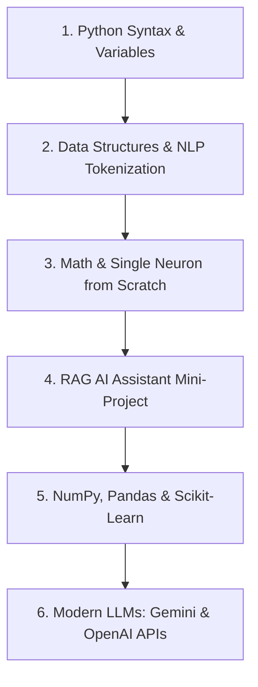

# 🚀 Python for AI — Beginner to Builder Course

Welcome to your dedicated Python & AI learning workspace! This folder contains runnable lessons and practical AI projects designed to take you from Python basics straight into Artificial Intelligence.

---

## 📂 Project Structure

| File | Topic & Goal |
| :--- | :--- |
| **`python.py`** | **Start here!** Interactive multi-lesson overview with live AI semantic search demo. |
| **`01_python_basics.py`** | Variables, conditionals, loops, functions, and a spam detection classifier. |
| **`02_data_structures_for_ai.py`** | Lists, list comprehensions, dictionaries, and building an NLP Tokenizer from scratch. |
| **`03_ai_from_scratch.py`** | Build & train a real Artificial Neuron with Sigmoid Activation and Gradient Descent. |
| **`04_ai_assistant_project.py`** | Build a terminal-based AI assistant using RAG (Retrieval Augmented Generation). |
| **`requirements.txt`** | Recommended libraries (NumPy, Pandas, Scikit-learn, Matplotlib). |

---

## 🛠️ How to Open & Run in PyCharm

### Step 1: Open Folder in PyCharm
1. Open **PyCharm**.
2. Click **File** -> **Open...** (or click **Open** on the Welcome screen).
3. Navigate to:
   ```
   C:\Users\ishit jain\Documents\antigravity\quirky-bell\python_learning
   ```
4. Choose **Open in this window** (or New window).

### Step 2: Configure the Python Interpreter
1. In PyCharm, press **Ctrl + Alt + S** (or go to **File** -> **Settings**).
2. In the left menu, select **Project: python_learning** -> **Python Interpreter**.
3. If no interpreter is selected, click **Add Interpreter** -> **Add Local Interpreter...**
4. Select **System Interpreter** (or Existing Environment) and choose your installed **Python 3.12** (`C:\Users\ishit jain\AppData\Local\Programs\Python\Python312\python.exe`).
5. Click **OK** / **Apply**.

### Step 3: Run Any File
- In the left **Project** panel, right-click on **`python.py`**.
- Click **Run 'python'** (or press **Shift + F10**).
- The interactive output will display in the **Run** window at the bottom of PyCharm!

---

## 🧭 Your AI Learning Roadmap



### Tips for Learning Fast
1. **Don't just read code — run and modify it!** Change values in `python.py` and see what happens.
2. **Break things on purpose**: Try changing the learning rate in `03_ai_from_scratch.py` to `0.01` or `2.0` and observe the effect on training loss.
3. **Use PyCharm's built-in debugger**: Set a breakpoint by clicking on the line number gutter and run with **Shift + F9** to inspect variables step-by-step.
